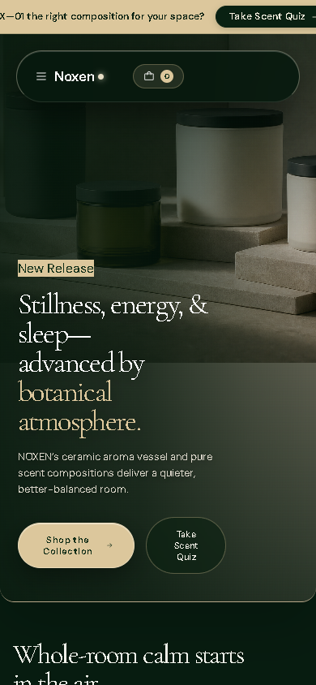

# Noxen Studio

Noxen is an editorial React e-commerce concept for a fictional home-fragrance brand. It combines product discovery, interactive storytelling, cart state, responsive navigation, and accessible controls in one focused experience.

> Portfolio concept: Noxen is fictional. Products, prices, account access, newsletter submission, and checkout behavior are simulated.

## Project overview

**Goal:** Preserve a magazine-like visual identity while keeping product exploration and cart actions understandable.

**My role:** Interface design, React implementation, interaction design, responsive styling, accessibility details, and documentation.

**Outcome:** A responsive storefront demonstration with connected product, ritual, story, cart, and account states.

## Screenshots

| Desktop | Mobile |
| --- | --- |
|  |  |

## Key functionality

- Responsive product collection with selectable featured products
- Cart drawer with quantity controls and calculated totals
- Interactive ritual selector and product-story sections
- Mobile navigation, account dialog, and newsletter feedback
- Keyboard-friendly controls, descriptive labels, and dialog semantics
- Responsive layouts that preserve the editorial hierarchy

## Architecture and decisions

- Product data is separated from interaction state and can be validated independently.
- A focused application shell coordinates featured products, cart state, dialogs, and story interactions.
- Native buttons, labels, and dialog semantics are used for interactive controls.
- Authentication, newsletter submission, and checkout remain local simulations.

## Technology

- React 19
- Vite
- JavaScript
- CSS
- Phosphor Icons
- Oxlint and Node test runner

## Run locally

```bash
npm install
npm run dev
```

## Quality checks

```bash
npm run lint
npm test
npm run build
```

GitHub Actions runs these checks for every pushed branch and pull request.

## Limitations

- No production authentication, inventory, payments, or order processing
- Cart state is browser-local and resets after a reload
- Products and editorial stories are fictional demonstration content

## Assets and reuse

See [ASSETS.md](ASSETS.md) for asset notes and [LICENSE](LICENSE) for reuse terms.
