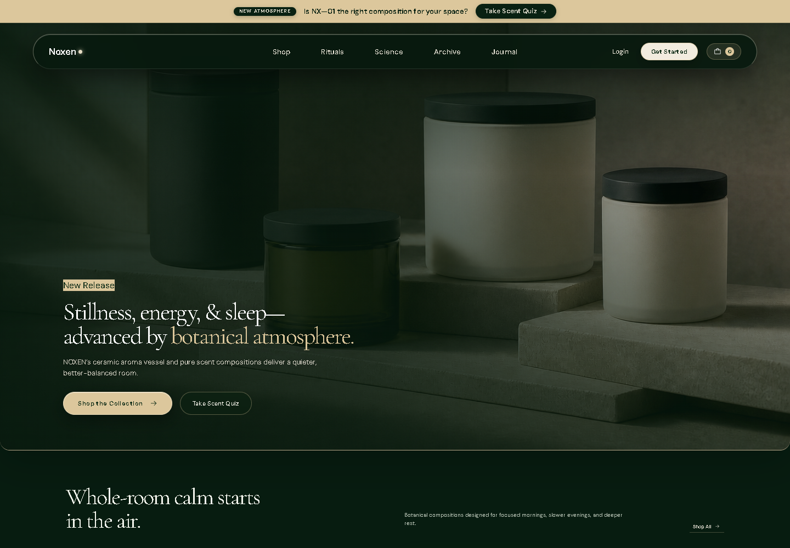
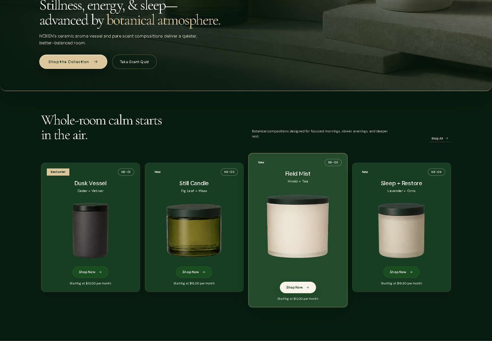

# Noxen Studio

**A cinematic commerce experience for a fictional home-fragrance studio.**

---

## Product story

Noxen combines editorial storytelling with practical storefront interactions. Product discovery, rituals, account moments, and cart decisions are presented as one atmospheric but understandable desktop experience.

| Focus | Contribution | Result |
| --- | --- | --- |
| Preserve visual character while keeping commerce actions clear | Interface design, React implementation, interaction design, accessibility, and documentation | A focused storefront demonstration connecting product, story, ritual, cart, and account states |

## Interface preview

| Homepage | Product collection |
| --- | --- |
|  |  |

## Experience highlights

- Product collection with selectable featured products
- Cart drawer with quantity controls and calculated totals
- Interactive ritual selector and layered product-story sections
- Account dialog and newsletter feedback states
- Keyboard-friendly controls, descriptive labels, and dialog semantics
- Desktop compositions that retain a strong editorial hierarchy

## Design and engineering

- Product data remains separate from interaction state and can be validated independently.
- A focused application shell coordinates featured products, cart state, dialogs, and story interactions.
- Native buttons, labels, and dialog semantics support accessible interaction.
- Authentication, newsletter submission, and checkout remain local simulations.

## Technology

React 19 · Vite · JavaScript · CSS · Phosphor Icons · Oxlint · Node test runner

## Run locally

~~~bash
npm install
npm run dev
~~~

## Quality checks

~~~bash
npm run lint
npm test
npm run build
~~~

GitHub Actions runs these checks for every pushed branch and pull request.

## Project note

> Noxen is a fictional portfolio brand. Products, prices, account access, newsletter submission, and checkout behavior are simulated.

## Assets and usage

See [ASSETS.md](ASSETS.md) for asset notes and [LICENSE](LICENSE) for reuse terms.
